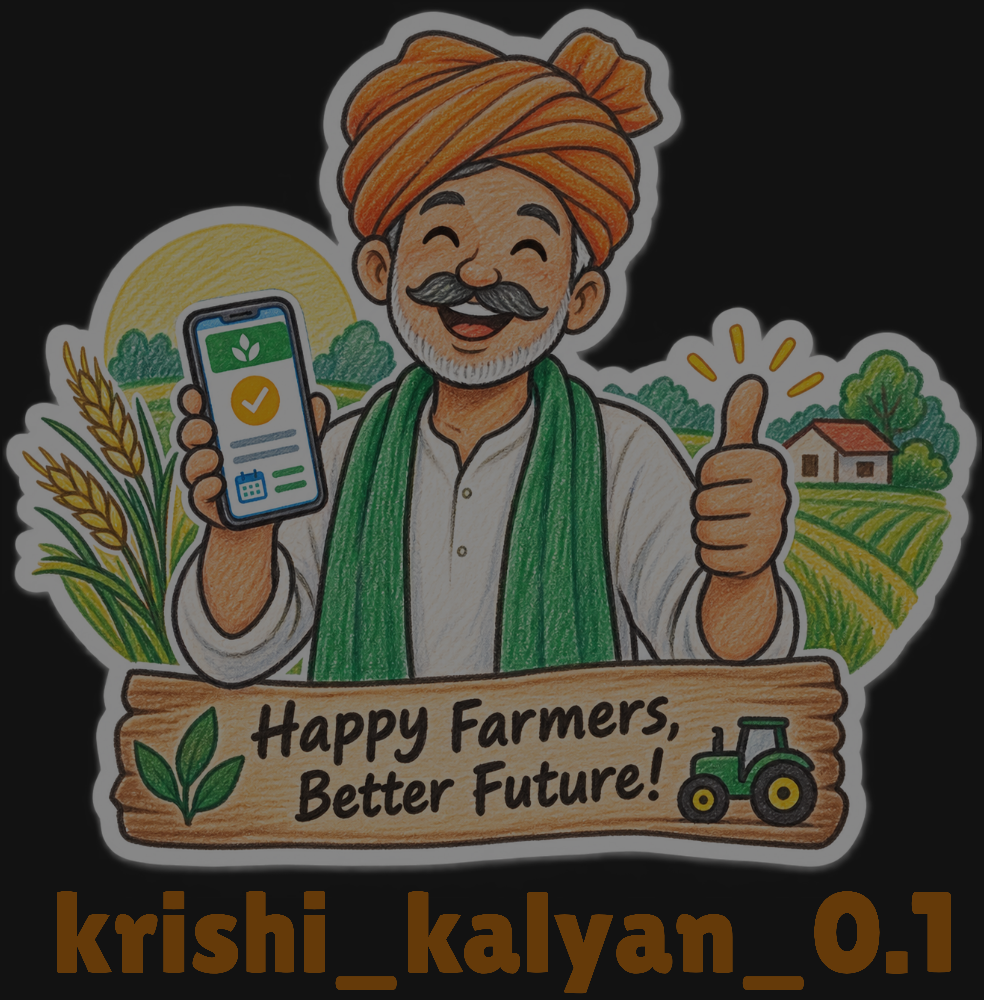

  

## 1. 🌾 Project Overview

Krishi Kalyan is a digital procurement management platform designed
to reduce waiting time, congestion, uncertainty, and lack of
procurement-status information faced by farmers.

The system provides:

- Farmer mobile application
- Farmer web portal
- Procurement center web portal
- Admin web portal
- Real-time token and queue management
- Procurement stage tracking
- Payment tracking
- SMS, push and email notifications
- AI/ML-based intelligent features

## 2. 🏆 SIH Problem Statement

**Problem Statement ID:** 26032

**Title:** Farmers often face long waiting times, lack of information
regarding procurement schedules, and uncertainty about procurement status.

**Organization:** Ministry of Consumer Affairs, Food & Public Distribution

**Department:** Department of Consumer Affairs (DoCA)

**Category:** Software

**Theme:** Smart Automation

## 3. 🧩 Problem we are solving

- Long waiting times
- Physical queues at procurement centers
- No real-time queue information
- Uncertainty about procurement status
- Lack of procurement-stage transparency
- Lack of payment-status transparency
- Congestion at procurement centers
- Difficulty knowing when to arrive
- Poor communication between farmer and center

## 4. 🎯 Our Proposed Solution

## 5. Key Features
## 6. System Architecture
## 7. Data Flow
## 8. User Roles
## 9. Application & Web Portals
## 10. Procurement Workflow
## 11. Payment Workflow
## 12. AI/ML Components
## 13. Technology Stack
## 14. Repository Structure
## 15. Database Architecture
## 16. API Architecture
## 17. Notification System
## 18. Security & Authentication
## 19. Deployment Architecture
## 20. Team & Responsibilities
## 21. Setup & Installation
## 22. Environment Variables
## 23. Running the Project
## 24. Testing
## 25. Screenshots / UI
## 26. Future Scope
## 27. SIH Innovation / USP
## 28. Contribution Guidelines
## 29. License